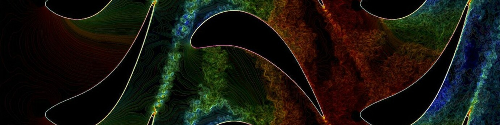

### Hey there 👋

🔭 &nbsp; I’ve always been driven by a blend of scientific curiosity and technical challenges.

🌟 &nbsp; I thrive on the synergy between science and number crunching—whether it's optimizing algorithms for novel HPC systems, implementing cutting-edge numerical methods or using machine learning to rethink traditional simulations.

🚀 &nbsp; In recent years, I've applied HPC to enable large-scale CFD simulations of turbulent flows and explored how machine learning can be used to develop smarter, data-driven turbulence models for large eddy simulation.

📝 &nbsp; Along the way, I’ve contributed to several open-source projects both inside and outside these fields.

💬 &nbsp; If you're into CFD, HPC, or the fusion of machine learning and simulation, feel free to reach out!

